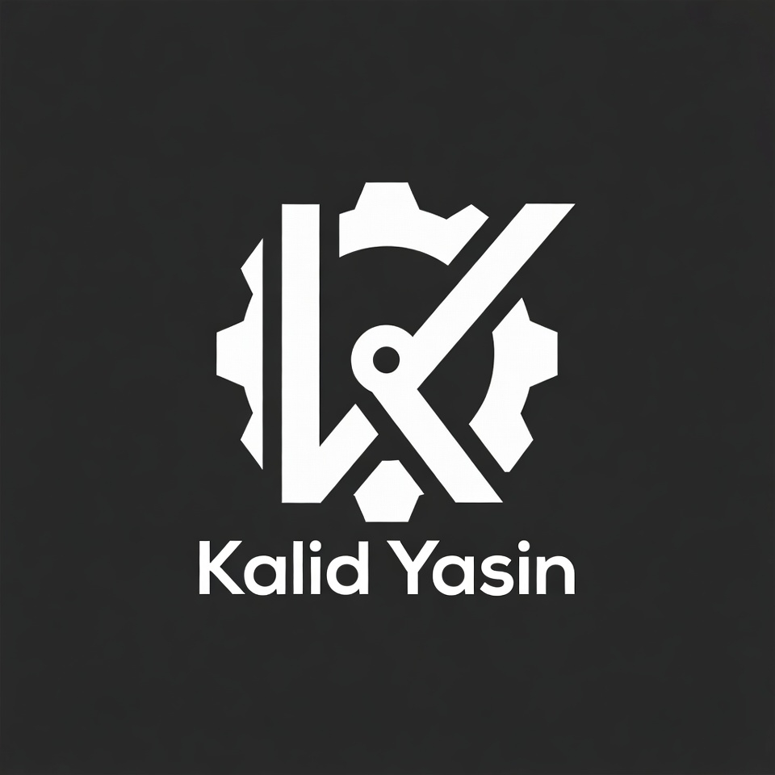

# Portfolio Terminal

A terminal-based portfolio website built with Rust and Yew, powered by Trunk.

## Features

*   Terminal-like interface
*   Displays portfolio information
*   Customizable content

## Installation

1.  Ensure you have Rust and Trunk installed. If not, you can install Rust from [rust-lang.org](https://www.rust-lang.org/tools/install) and Trunk with `cargo install trunk`.
2.  Clone the repository: `git clone https://github.com/kalidyasin/kalidyasin.github.io.git`
3.  Navigate to the project directory: `cd kalidyasin.github.io`
4.  Build and run the application: `trunk serve`

## Usage

Access the application through your web browser after running `trunk serve`. The terminal interface will guide you through the available commands.

## Contributing

Contributions are welcome! Please open an issue or submit a pull request.

## License

This project is licensed under the MIT License. See the [LICENSE](LICENSE) file for details.
